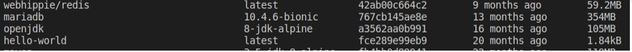
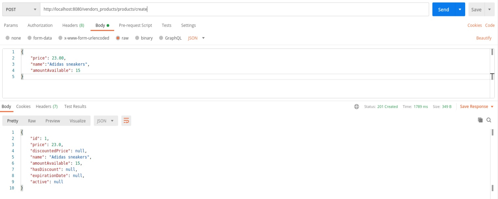

# Contenedores Docker

Una imagen de contenedor de Docker es un paquete de software ligero, independiente y 
ejecutable que incluye todo lo necesario para ejecutar una aplicación: código, herramientas del sistema, bibliotecas del sistema y configuraciones. Al tener
dos microservicios separados, uno para las estadísticas y otro para el servicio de vendedores/productos tendremos inicialmente dos contenedores 
con todas las dependencias necesarias para ejecutar los servicios. 

Como los servicios están desarrollados en java, la base de nuestros contenedores debe contener al menos la 
versión mínima de Java (JDK 8 definida anteriormente) soportada por la aplicación. 

Una de las imágenes base (sobre la que iremos añadiendo paquetes según sea necesario) más populares
es Alpine por su tamaño frente a otras distribuciones Linux. Afortunadamente en DockerHub existe una
imagen oficial de Alpine que incluye el OpenJDK de Java.




Una vez seleccionada la imagen base, a través de un fichero Dockerfile
establecemos las necesidades adicionales de nuestro contenedor.


Llegados a este punto tenemos Java para ejecutar la aplicación, pero no hemos tenido en cuenta el empaquetado. Como empleamos Maven, tenemos
varias opciones. Primeramente, se podría compilar el proyecto en el sistema de archivos local y copiarlo luego al contenedor, de manera similar
a esta:

```
FROM openjdk:8-jdk-alpine
ARG JAR_FILE=target/*.jar
COPY ${JAR_FILE} app.jar
ENTRYPOINT ["java","-jar","/app.jar"]
```

En este archivo estaríamos definiendo la imagen base de Alpine con OpenJDK 8, copiando el jar de nuestro
servicio previamente empaquetado y ejecutándolo. Esta variante tiene el inconveniente de establecer dependencias a software fuera del contenedor. Alternativamente podríamos
definir la instalación de Maven en el Dockerfile, lo cual ralentizaría el proceso de construcción del contenedor. Afortunadamente,
en DockerHub existe una imagen de Alpine con Maven pre-instalado solamente 10 Mb más grande que la base de Alpine escogida:


De esta manera el Dockerfile quedaría:

```
FROM maven:3.5-jdk-8-alpine
WORKDIR /app
COPY  /vendors_products /app
RUN mvn package
ENTRYPOINT ["java","-jar","target/vendors_products-0.1.jar"]
```

En la línea COPY se copia todo el contenido de la carpeta vendors_products a una carpeta app en el contenedor.
Al ejecutar mvn package, Maven lee el fichero pom.xml del microservicio, descarga las dependencias, ejecuta los test
y empaqueta la aplicación en un solo fichero vendors_products-0.1.jar. La instrucción ENTRYPOINT nos permite
configurar el contenedor como un ejecutable. Aunque con esto tenemos un contenedor funcional, es una buena práctica
no ejecutar los contenedores como root por lo que definirimos otro usuario denominado spring:

FROM maven:3.5-jdk-8-alpine
LABEL "maintainer"="mariocrosl@gmail.com"
EXPOSE 8080/tcp
WORKDIR /app
COPY  /vendors_products /app
RUN mvn package
RUN addgroup -S spring && adduser -S spring -G spring
USER spring:spring
ENTRYPOINT ["java","-jar","target/vendors_products-0.1.jar"]

Con LABEL añadimos metadatos al contenedor, en este caso su creador. Con EXPOSE instruimos a cualquiera que
use la imagen que el puerto 8080 (tradicional de Tomcat) debería estar disponible. Con este Dockerfile ejecutamos
la instrucción:

docker build -t ugr_cc/vendors_products:1.0 .

De esta manera lo construimos y le asignamos un nombre. Para subirlo a DockerHub es necesario crear un repositorio. Una vez creado
le aplicamos un tag a la imagen construida anteriormente:

docker tag ugr_cc/vendors_products:1.0  mariocrosldocker/ugr_cc_vendor_products:1.0

Esta imagen es la que podemos subir al registro ejecutando push (similar a Git). Al ejecutar el contenedor vemos
la aplicación levantada en el puerto 8080 por el usuario spring:


Para probar que el servicio funciona podemos ejecutar alguna petición por ejemplo con [Postman] (https://www.postman.com/). Por ejmplo podemos crear
un nuevo producto:



Y luego obtener la lista de productos insertados:


### Licencia
[GNU General Public License v3.0](https://github.com/mcrosales/CC-19-20-Proyecto/blob/master/LICENSE) 


### Bibliografía (tanto para consulta como para copia de instrucciones, de las cuales no pretendo por ningún motivo atribuirme su creación)

[Desarrollo basado en pruebas](https://jj.github.io/CC/documentos/temas/Desarrollo_basado_en_pruebas)

[Clases de Cloud Computing](https://github.com/JJ/CC-19-20)

[Spring Boot](https://spring.io/projects/spring-boot)

[Spring Boot y Docker] (https://spring.io/guides/gs/spring-boot-docker/)

[Docker](https://www.docker.com/resources/what-container)

[Referencia Docker](https://docs.docker.com/engine/reference/builder/)


